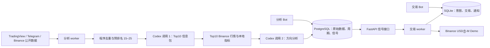

# 架构与数据流

本项目由独立分析服务和独立执行服务组成。REST 是唯一的服务间业务接口；交易服务不读取分析数据库的内部表结构。

## 分析侧

1. 从 Binance USDⓈ-M `exchangeInfo` 获取可交易 Universe，只接受 USDT、PERPETUAL、TRADING。
2. 采集 TradingView Coins/CEX 榜单和 Ideas、Binance 异动榜、Telegram 白名单；保存原始内容和来源信息。
3. 程序做符号映射、精确/近似去重、衰减、来源上限和排名，生成 15–25 个候选。
4. 第一次结构化 Codex 调用从候选中选出 10 个不同币种，并为每个币生成独立信息包和证据引用。
5. 只给 Top10 采集较重行情；第二次结构化 Codex 调用批量产出方向分析。最终发布 1–3 个新鲜价格信号；模型未选择时程序按置信度选一个。

异常周期标记 FAILED，不刷新旧信号时间。所有模型输入/输出、市场原始响应、健康信息和信号都可在 PostgreSQL 中审计。

## 执行侧

交易 worker 读取 REST 最新信号，检查信号 ID、方向、60 秒开仓期限、暂停状态、账户、持仓、订单、精度、资金保留和 TP 可达性。它先持久化订单意图，再用稳定 client ID 提交市场入场单。网络响应未知时先查询原订单，不重复开仓。

实际成交后程序冻结原始 TP/SL；SL 是条件市价单、TP 是 reduce-only 限价单。交易账本保存在独立 SQLite，重启时继续核对持仓、订单和成交。净 PnL 只包括已实现交易盈亏减成交手续费，不包括资金费。

## 管理边界

分析 Bot 仅控制分析参数、来源和分析启停；交易 Bot 仅控制新仓暂停、交易默认参数、账本和保护重试。两者都同时校验 Telegram chat ID 和 user ID，且设置先预览后保存。
